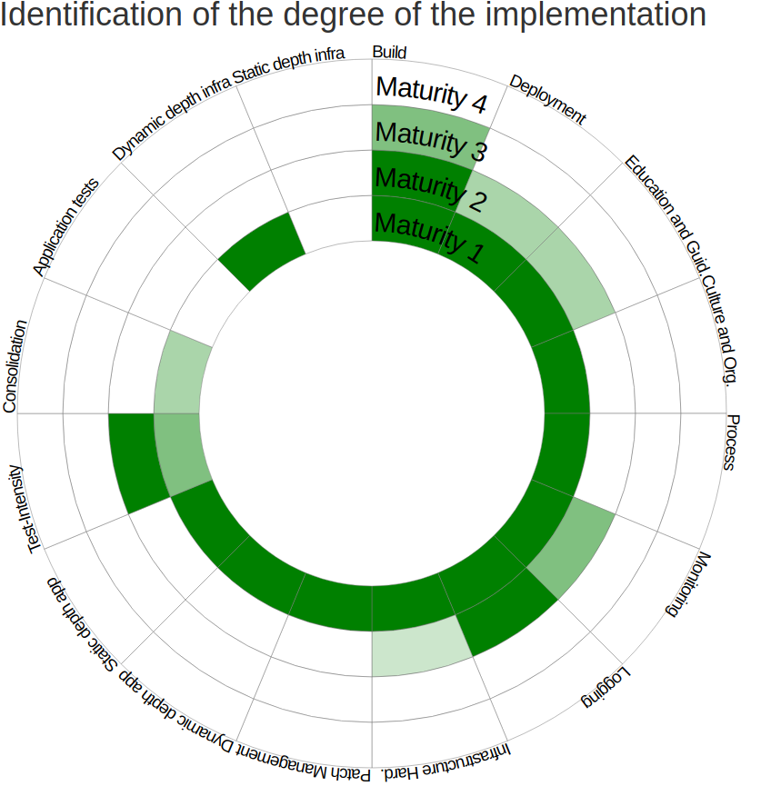

# OWASP DevSecOps Maturity Model (DSOMM) Baseline Using GitHub API

This project leverages the [OWASP DevSecOps Maturity Model (DSOMM)](https://owasp.org/www-project-devsecops-maturity-model) framework to perform comprehensive security assessments on GitHub repositories using the GitHub CLI. By automating checks aligned with DSOMM guidance, it enables organizations to conduct customizable security audits, generate detailed reports and maintain consistent security standards across their software development lifecycle.

The [OWASP DevSecOps Maturity Model (DSOMM)](https://owasp.org/www-project-devsecops-maturity-model) is a robust framework designed to help organizations evaluate and systematically enhance their DevSecOps practices. It provides a structured approach to integrating security seamlessly into the software development process, offering a clear roadmap for advancing DevSecOps capabilities.

**Key features of DSOMM include:**
* Five main dimensions: Build and Deployment, Implementation, Culture and Organization, Information Gathering and Test and Verification.
* Five maturity levels for each dimension, allowing organizations to assess and improve their security practices incrementally.
* A flexible, iterative approach that aligns well with agile development practices.

This python framewrok automates security checks using the GitHub API, providing a practical implementation of [DSOMM principles](https://dsomm.owasp.org/). It helps organizations identify their current DevSecOps maturity level, set targeted improvement goals and track progress towards enhanced security integration.



## Features
Key features of this baseline framework:
* Supports multiple security check levels (LEVEL1 to LEVEL5) aligned with DSOMM maturity levels.
* Allows checking multiple repositories simultaneously.
* Configurable security checks via YAML file [dsomm_checks.yaml](./dsomm_checks.yaml).
* Flexible check selection (by level, specific checks or all checks).
* Provides flexible tabular format and CSV output options.
* Score calculation for each security level and overall repository security.

## Requirements
* Python 3.7+
* PyYAML
* tabulate
* gh cli authenticated with write/admin permissions to fetch data

## Supported Checks

<details>
<summary>Supported Checks For Each DSOMM Level</summary>

### Level 1 : Basic understanding of security practices
| DSOMM Baseline | Description  | 
| :------------ |:---------------|
| [automated_prs](./checks/l1_1_automated_prs.py) | Look for PRs that have been created by bots or specific tools commonly used for automated dependency updates, such as Dependabot. |
| [versioning](./checks/l1_2_versioning.py)        | Look for common versioning indicators such as version files, tags, or release information. |
| [test_stored_secrets](./checks/l1_3_test_stored_secrets.py) | Check if secret scanning alerts are enabled. |

### Level 2: Adoption of basic security practices
| DSOMM Baseline | Description  | 
| :------------ |:---------------|
| [artifact_pinning](./checks/l2_1_artifact_pinning.py)  |  Look if artifact pinning is enabled for a the repository.  |
| [sbom](./checks/l2_2_sbom.py)  |  Look for SBOM information for the repository  |
| [automated_pr_merges](./checks/l2_3_automated_pr_merges.py)  |  Look for PRs that have been created by bots or specific tools.  |
| [mfa](./checks/l2_4_mfa.py)  |  Look for repository owner's username and then check their MFA status  |
| [serverside_sca](./checks/l2_5_serverside_sca.py)  |  Look for SCA tool configuration files  |
| [test_libyear](./checks/l2_6_test_libyear.py)  |  Look for libyear-related files  |

### Level 3: High adoption of security practices
| DSOMM Baseline | Description  | 
| :------------ |:---------------|
| [code_signing](./checks/l3_1_code_signing.py) | Look for code signing by examining the verification status of the latest commit  |
| [dependency_inventory](./checks/l3_2_dependency_inventory.py) | Check for the presence of a Software Bill of Materials (SBOM) or dependency graph |
| [version_update_approvals](./checks/l3_3_version_update_approvals.py) | Look for reviewers by examining whether there are any reviewers in the latest PR |
| [defect_visualization](./checks/l3_4_defect_visualization.py) | Check if the repository has vulnerability alerts enabled |
| [patch_management_stats](./checks/l3_5_patch_management_stats.py) | Check for pull requests related to dependency updates and security patches |
| [treatment_of_defects_middle](./checks/l3_6_treatment_of_defects_middle.py) | Look for a rule that protect the main branch to have vulnerabilities with severity middle |
| [vulnerability_management](./checks/l3_7_vulnerability_management.py) | Check for enabled Dependabot alerts, code scanning alerts, and secret scanning alerts |
| [client_side_sca](./checks/l3_8_client_side_sca.py) | Check for client-side SCA tool configurations and related GitHub Actions workflows |
| [sast_clientside_components](./checks/l3_9_sast_clientside_components.py) | Check for client-side static analysis tool configurations and related GitHub Actions workflows |
| [sast_serverside_components](./checks/l3_10_sast_serverside_components'.py) | Check for server-side static analysis tool configurations and related GitHub Actions workflows |

### Level 4: Very high adoption of security practices
| DSOMM Baseline | Description  | 
| :------------ |:---------------|
| [gitignore](./checks/l4_1_gitignore.py) | Look for the presence of a .gitignore file |
| [advanced_defect_visualization](./checks/l4_2_advanced_defect_visualization.py) | Check for visualization-related files, tool integrations, and GitHub Actions workflows |
| [reproducible_defects](./checks/l4_3_reproducible_defects.py) | Check for bug report templates, reproducibility labels, and issues with reproduction steps |
| [sast_self_components](./checks/l4_4_sast_self_components.py) | Check for configuration files of common static analysis tools and related GitHub Actions workflows |
| [multiple_analyzers](./checks/l4_5_multiple_analyzers.py) | Check for configuration files of various analyzers and related GitHub Actions workflows |
| [correlate_cve_images](./checks/l4_6_correlate_cve_images.py) | Check for configuration files of vulnerability scanning tools and related GitHub Actions workflows |
| [test_known_cves](./checks/l4_7_test_known_cves.py) | Check for GitHub Advanced Security, vulnerability scanning tool configurations, and related GitHub Actions workflows |
| [test_infra_known_cves](./checks/l4_8_test_infra_known_cves.py) | Check for infrastructure vulnerability scanning tool configurations and related GitHub Actions workflows |

### Level 5: Advanced deployment of security practices at scale
| DSOMM Baseline | Description  | 
| :------------ |:---------------|
| [artifact_sigining](./checks/l5_1_artifact_sigining.py) | Look for artifact siginature |
| [treatment_of_defects_all](./checks/l5_2_treatment_of_defects_all.py) | Check for the treatment of all defects as part of Test and Verification in a GitHub repository. |
| [sast_all](./checks/l5_3_sast_all.py) | Check for static analysis configuration in a repository. |

</details>

### Extend or Enable support for new checks
To add support for new DSOMM checks:
* Create a new Python module in the [checks](./checks) directory.
* Implement the check function in the placeholder file.
* Update [dsomm_checks.yaml](./dsomm_checks.yaml) to include the new check support to true and include its module name.

## Setup

- **[requirements.txt](./requirements.txt)**: Lists the Python dependencies required to run the project.
- **[main.py](./main.py)**: The main script to run selected checks for each dsomm level on specified repositories.
- **[checks](./checks)**: Contains individual Python scripts for each check. Each script defines a function that performs a specific check.

1. **Clone the repository**:
   ```bash
   git clone https://github.com/ModusCreate-NFR/devsecops-maturity-model-baseline.git
   cd devsecops-maturity-model-baseline
   ```
2. **Create and activate python virtual environment**:
   ```bash
   python3 -m venv dsomm-venv
   ```
   
   #### For Unix or MacOS:
   ```bash
   source dsomm-venv/bin/activate
   ```
   
   #### For Windows:
   ```bash
   dsomm-venv\Scripts\activate
   ```
4. **Install the required dependencies**:
   ```bash
   pip install -r requirements.txt
   ```
5. **Install and authenticate GitHub CLI**:

   Follow the instructions at [GitHub CLI](https://cli.github.com/) to install and authenticate.
   
   For authentication run the following command and follow the prompts:
   ```bash
   gh auth login
   ```
   You'll be asked to choose:
   * The account to log into (GitHub.com or GitHub Enterprise)
   * Your preferred protocol for Git operations (HTTPS or SSH)
   * Whether to authenticate Git with your GitHub credentials
   * How to authenticate (web browser or authentication token)

## Usage
**Run the main script**:

   Execute main.py to start the process:
   ```bash
   python3 main.py
   ```
It will be prompted with set of DSOMM Levels and Checks to choose to run for a given repo(s)
1. **Select checks**:

   You will be presented with a list of available checks grouped as per owasp dsomm levels.

   Enter the levels (Level1, Level2 etc.,) or specific check numbers or type 'ALL' to run all checks

2. **Enter repositories**:

   Provide a comma-separated list of repositories in the format github-org/repo (e.g., Modus/testrepo).

3. **Choose the output format (tabular or csv)**:
   For tabular output, results will be displayed in the console.
   For CSV output, specify custom file path and name to save the results.
   
   The script will output has the results of each selected check for each repository and
   Score summery for the checks in selected Level(s).

   OWASP DSOMM Level statistics will be displayed, indicating the number of successful checks per group.

### Example runs
<details>
<summary>Example run to list all the checks and save the results in csv</summary>


```
~/devsecops-maturity-model-baseline ‹main*› » python3 main.py
Show all checks in menu (including not supported)?, default is N (y/N): Y
Available checks:

LEVEL1:
  1. Defined build process (Not Supported)
  2. Defined deployment process (Not Supported)
  3. A patch policy is defined (Not Supported)
  4. Automated PRs for patches (Supported)
  5. Conduction of simple threat modeling on technical level (Not Supported)
  6. Ad-Hoc Security trainings for software developers (Not Supported)
  7. Security consulting on request (Not Supported)
  8. Definition of simple BCDR practices for critical components (Not Supported)
  9. App. Hardening Level 1 (50%) (Not Supported)
  10. Contextualized Encoding (Not Supported)
  11. Versioning (Supported)
  12. MFA for admins (Not Supported)
  13. Simple access control for systems (Not Supported)
  14. Usage of edge encryption at transit (Not Supported)
  15. Centralized system logging (Not Supported)
  16. Simple application metrics (Not Supported)
  17. Simple budget metrics (Not Supported)
  18. Simple system metrics (Not Supported)
  19. Simple false positive treatment (Not Supported)
  20. Test for stored secrets (Supported)
  21. Default settings for intensity (Not Supported)
  22. High test intensity (Not Supported)

LEVEL2:
  23. Building and testing of artifacts in virtual environments (Not Supported)
  24. Pinning of artifacts (Supported)
  25. SBOM of components (Supported)
  26. Defined decommissioning process (Not Supported)
  27. Environment depending configuration parameters (secrets) (Not Supported)
  28. Evaluation of the trust of used components (Not Supported)
  29. Automated merge of automated PRs (Supported)
  30. Nightly build of images (base images) (Not Supported)
  31. Reduction of the attack surface (Not Supported)
  32. Usage of a maximum lifetime for images (Not Supported)
  33. Information security targets are communicated (Not Supported)
  34. Each team has a security champion (Not Supported)
  35. Regular security training for all (Not Supported)
  36. Regular security training of security champions (Not Supported)
  37. Reward of good communication (Not Supported)
  38. Security code review (Not Supported)
  39. App. Hardening Level 1 (Not Supported)
  40. Source Control Protection (Not Supported)
  41. Applications are running in virtualized environments (Not Supported)
  42. Backup (Not Supported)
  43. Baseline Hardening of the environment (Not Supported)
  44. Isolated networks for virtual environments (Not Supported)
  45. MFA (Supported)
  46. Usage of an security account (Not Supported)
  47. Usage of encryption at rest (Not Supported)
  48. Usage of test and production environments (Not Supported)
  49. Virtual environments are limited (Not Supported)
  50. Logging of security events (Not Supported)
  51. Visualized logging (Not Supported)
  52. Alerting (Not Supported)
  53. Monitoring of costs (Not Supported)
  54. Visualized metrics (Not Supported)
  55. Security unit tests for important components (Not Supported)
  56. Treatment of defects with severity high or higher (Not Supported)
  57. Coverage of client side dynamic components (Not Supported)
  58. Simple Scan (Not Supported)
  59. Usage of different roles (Not Supported)
  60. Test for exposed services (Not Supported)
  61. Test network segmentation (Not Supported)
  62. Test of the configuration of cloud environments (Not Supported)
  63. API design validation (Not Supported)
  64. Software Composition Analysis (server side) (Supported)
  65. Test for Time to Patch (Not Supported)
  66. Test libyear (Supported)
  67. Test cluster deployment resources (Not Supported)
  68. Test for image lifetime (Not Supported)
  69. Test of virtualized environments (Not Supported)
  70. Test the cloud configuration (Not Supported)
  71. Test the definition of virtualized environments (Not Supported)
  72. Regular tests (Not Supported)

LEVEL3:
  73. Signing of code (Supported)
  74. Handover of confidential parameters (Not Supported)
  75. Inventory of dependencies (Not Supported)
  76. Inventory of running artifacts (Supported)
  77. Rolling update on deployment (Not Supported)
  78. Conduction of simple threat modeling on business level (Not Supported)
  79. Creation of simple abuse stories (Not Supported)
  80. Creation of threat modeling processes and standards (Not Supported)
  81. Conduction of build-it, break-it, fix-it contests (Not Supported)
  82. Security Coaching (Not Supported)
  83. Security-Lessoned-Learned (Not Supported)
  84. Simple mob hacking (Not Supported)
  85. Approval by reviewing any new version (Supported)
  86. Definition of a change management process (Not Supported)
  87. App. Hardening Level 2 (75%) (Not Supported)
  88. API design validation (Not Supported)
  89. Filter outgoing traffic (Not Supported)
  90. Immutable infrastructure (Not Supported)
  91. Infrastructure as Code (Not Supported)
  92. Limitation of system events (Not Supported)
  93. Role based authentication and authorization (Not Supported)
  94. Usage of internal encryption at transit (Not Supported)
  95. Usage of security by default for components (Not Supported)
  96. WAF baseline (Not Supported)
  97. Centralized application logging (Not Supported)
  98. Advanced availability and stability metrics (Not Supported)
  99. Audit of system events (Not Supported)
  100. Deactivation of unused metrics (Not Supported)
  101. Grouping of metrics (Not Supported)
  102. Targeted alerting (Not Supported)
  103. Security integration tests for important components (Not Supported)
  104. Simple visualization of defects (Supported)
  105. Generation of Patch Management Statistics (Supported)
  106. Generation of Response Statistics (Not Supported)
  107. Integration of vulnerability issues into the development process (Not Supported)
  108. Treatment of defects with severity middle (Supported)
  109. Usage of a vulnerability management system (Supported)
  110. Coverage of hidden endpoints (Not Supported)
  111. Coverage of more input vectors (Not Supported)
  112. Coverage of sequential operations (Not Supported)
  113. Test for unauthorized installation (Not Supported)
  114. Weak password test (Not Supported)
  115. Local development security checks performed (Not Supported)
  116. Software Composition Analysis (client side) (Supported)
  117. Static analysis for important client side components (Supported)
  118. Static analysis for important server side components (Supported)
  119. Test for Patch Deployment Time (Not Supported)
  120. Analyze logs (Not Supported)
  121. Test for malware (Not Supported)
  122. Test for new image version (Not Supported)
  123. Deactivating of unneeded tests (Not Supported)

LEVEL4:
  124. Same artifact for environments (Not Supported)
  125. Usage of feature toggles (Not Supported)
  126. Usage of a short maximum lifetime for images (Not Supported)
  127. Conduction of advanced threat modeling (Not Supported)
  128. Aligning security in teams (Not Supported)
  129. Conduction of collaborative team security checks (Not Supported)
  130. Conduction of war games (Not Supported)
  131. Regular security training for externals (Not Supported)
  132. App. Hardening Level 2 (Not Supported)
  133. .gitignore (Supported)
  134. Hardening of the Environment (Not Supported)
  135. Production near environments are used by developers (Not Supported)
  136. Usage of a chaos monkey (Not Supported)
  137. WAF medium (Not Supported)
  138. Advanced app. metrics (Not Supported)
  139. Coverage and control metrics (Not Supported)
  140. Defense metrics (Not Supported)
  141. Screens with metric visualization (Not Supported)
  142. Smoke Test (Not Supported)
  143. Advanced visualization of defects (Supported)
  144. Reproducible defect tickets (Supported)
  145. Usage of multiple scanners (Not Supported)
  146. Load tests (Not Supported)
  147. Static analysis for all self written components (Supported)
  148. Usage of multiple analyzers (Supported)
  149. Correlate known vulnerabilities in infrastructure with new image versions (Supported)
  150. Test for known vulnerabilities (Supported)
  151. Test of infrastructure components for known vulnerabilities (Supported)
  152. Creation and application of a testing concept (Not Supported)

LEVEL5:
  153. Signing of artifacts (Supported)
  154. Blue/Green Deployment (Not Supported)
  155. Creation of advanced abuse stories (Not Supported)
  156. Conduction of collaborative security checks with devs and system admins (Not Supported)
  157. App. Hardening Level 3 (Not Supported)
  158. Local development linting & style checks performed (Not Supported)
  159. Microservice-architecture (Not Supported)
  160. WAF Advanced (Not Supported)
  161. Correlation of security events (Not Supported)
  162. PII logging concept (Not Supported)
  163. Metrics are combined with tests (Not Supported)
  164. High coverage of security related module and integration tests (Not Supported)
  165. Treatment of all defects (Supported)
  166. Coverage analysis (Not Supported)
  167. Coverage of service to service communication (Not Supported)
  168. Test for unused Resources (Not Supported)
  169. Dead code elimination (Not Supported)
  170. Exclusion of source code duplicates (Not Supported)
  171. Static analysis for all components/libraries (Supported)
  172. Stylistic analysis (Not Supported)

Enter the levels (Level1, Level2 etc.,) or specific check numbers or type 'ALL' to run all checks: all
Enter the repositories to check (comma-separated, format: github-org/repo): ModusCreate/test-repo
Enter output format (tabular/csv, default is tabular): csv
Enter the path and filename for the CSV file (e.g., /path/to/output.csv): ./dsomm-test-repo.csv
Show all checks in output (including Not Supported)?, default is Y (Y/n):
Results have been saved to ./dsomm-test-repo.csv
```
</details>


<details>
<summary>Example run to list only supported checks at the input and share all the checks results in tabular format</summary>

```
~/devsecops-maturity-model-baseline ‹main*› » python3 main.py
Show all checks in menu (including not supported)?, default is N (y/N): N
Available checks:

LEVEL1:
  1. Automated PRs for patches (Supported)
  2. Versioning (Supported)
  3. Test for stored secrets (Supported)

LEVEL2:
  4. Pinning of artifacts (Supported)
  5. SBOM of components (Supported)
  6. Automated merge of automated PRs (Supported)
  7. MFA (Supported)
  8. Software Composition Analysis (server side) (Supported)
  9. Test libyear (Supported)

LEVEL3:
  10. Signing of code (Supported)
  11. Inventory of running artifacts (Supported)
  12. Approval by reviewing any new version (Supported)
  13. Simple visualization of defects (Supported)
  14. Generation of Patch Management Statistics (Supported)
  15. Treatment of defects with severity middle (Supported)
  16. Usage of a vulnerability management system (Supported)
  17. Software Composition Analysis (client side) (Supported)
  18. Static analysis for important client side components (Supported)
  19. Static analysis for important server side components (Supported)

LEVEL4:
  20. .gitignore (Supported)
  21. Advanced visualization of defects (Supported)
  22. Reproducible defect tickets (Supported)
  23. Static analysis for all self written components (Supported)
  24. Usage of multiple analyzers (Supported)
  25. Correlate known vulnerabilities in infrastructure with new image versions (Supported)
  26. Test for known vulnerabilities (Supported)
  27. Test of infrastructure components for known vulnerabilities (Supported)

LEVEL5:
  28. Signing of artifacts (Supported)
  29. Treatment of all defects (Supported)
  30. Static analysis for all components/libraries (Supported)

Enter the levels (Level1, Level2 etc.,) or specific check numbers or type 'ALL' to run all checks: all
Enter the repositories to check (comma-separated, format: github-org/repo): ModusCreate/test-repo
Enter output format (tabular/csv, default is tabular):
Show all checks in output (including Not Supported)?, default is Y (Y/n):
+---------------------------------------------------------------------------+------------------------------------------------------------------------------------------------------------------------------------------------------------------+
| Security Feature                                                          | ModusCreate/test-repo                                                                                                                                            |
+===========================================================================+==================================================================================================================================================================+
| Defined build process                                                     | Not Supported - Manual Process                                                                                                                                   |
+---------------------------------------------------------------------------+------------------------------------------------------------------------------------------------------------------------------------------------------------------+
| Defined deployment process                                                | Not Supported - Manual Process                                                                                                                                   |
+---------------------------------------------------------------------------+------------------------------------------------------------------------------------------------------------------------------------------------------------------+
| A patch policy is defined                                                 | Not Supported - Manual Process                                                                                                                                   |
+---------------------------------------------------------------------------+------------------------------------------------------------------------------------------------------------------------------------------------------------------+
| Automated PRs for patches                                                 | Detected (35 in last 30 days)                                                                                                                                    |
+---------------------------------------------------------------------------+------------------------------------------------------------------------------------------------------------------------------------------------------------------+
| Conduction of simple threat modeling on technical level                   | Not Supported - Manual Process                                                                                                                                   |
+---------------------------------------------------------------------------+------------------------------------------------------------------------------------------------------------------------------------------------------------------+
| Ad-Hoc Security trainings for software developers                         | Not Supported - Manual Process                                                                                                                                   |
+---------------------------------------------------------------------------+------------------------------------------------------------------------------------------------------------------------------------------------------------------+
| Security consulting on request                                            | Not Supported - Manual Process                                                                                                                                   |
+---------------------------------------------------------------------------+------------------------------------------------------------------------------------------------------------------------------------------------------------------+
| Definition of simple BCDR practices for critical components               | Not Supported - Manual Process                                                                                                                                   |
+---------------------------------------------------------------------------+------------------------------------------------------------------------------------------------------------------------------------------------------------------+
| App. Hardening Level 1 (50%)                                              | Not Supported - Manual Process                                                                                                                                   |
+---------------------------------------------------------------------------+------------------------------------------------------------------------------------------------------------------------------------------------------------------+
| Contextualized Encoding                                                   | Not Supported - Manual Process                                                                                                                                   |
+---------------------------------------------------------------------------+------------------------------------------------------------------------------------------------------------------------------------------------------------------+
| Versioning                                                                | Detected (file: package.json)                                                                                                                                    |
+---------------------------------------------------------------------------+------------------------------------------------------------------------------------------------------------------------------------------------------------------+
| MFA for admins                                                            | Not Supported - Manual Process                                                                                                                                   |
+---------------------------------------------------------------------------+------------------------------------------------------------------------------------------------------------------------------------------------------------------+
| Simple access control for systems                                         | Not Supported - Manual Process                                                                                                                                   |
+---------------------------------------------------------------------------+------------------------------------------------------------------------------------------------------------------------------------------------------------------+
| Usage of edge encryption at transit                                       | Not Supported - Manual Process                                                                                                                                   |
+---------------------------------------------------------------------------+------------------------------------------------------------------------------------------------------------------------------------------------------------------+
| Centralized system logging                                                | Not Supported - Manual Process                                                                                                                                   |
+---------------------------------------------------------------------------+------------------------------------------------------------------------------------------------------------------------------------------------------------------+
| Simple application metrics                                                | Not Supported - Manual Process                                                                                                                                   |
+---------------------------------------------------------------------------+------------------------------------------------------------------------------------------------------------------------------------------------------------------+
| Simple budget metrics                                                     | Not Supported - Manual Process                                                                                                                                   |
+---------------------------------------------------------------------------+------------------------------------------------------------------------------------------------------------------------------------------------------------------+
| Simple system metrics                                                     | Not Supported - Manual Process                                                                                                                                   |
+---------------------------------------------------------------------------+------------------------------------------------------------------------------------------------------------------------------------------------------------------+
| Simple false positive treatment                                           | Not Supported - Manual Process                                                                                                                                   |
+---------------------------------------------------------------------------+------------------------------------------------------------------------------------------------------------------------------------------------------------------+
| Test for stored secrets                                                   | Detected: Secret scanning enabled                                                                                                                                |
+---------------------------------------------------------------------------+------------------------------------------------------------------------------------------------------------------------------------------------------------------+
| Default settings for intensity                                            | Not Supported - Manual Process                                                                                                                                   |
+---------------------------------------------------------------------------+------------------------------------------------------------------------------------------------------------------------------------------------------------------+
| High test intensity                                                       | Not Supported - Manual Process                                                                                                                                   |
+---------------------------------------------------------------------------+------------------------------------------------------------------------------------------------------------------------------------------------------------------+
| Building and testing of artifacts in virtual environments                 | Not Supported - Manual Process                                                                                                                                   |
+---------------------------------------------------------------------------+------------------------------------------------------------------------------------------------------------------------------------------------------------------+
| Pinning of artifacts                                                      | Not enabled                                                                                                                                                      |
+---------------------------------------------------------------------------+------------------------------------------------------------------------------------------------------------------------------------------------------------------+
| SBOM of components                                                        | Detected (21 packages)                                                                                                                                           |
+---------------------------------------------------------------------------+------------------------------------------------------------------------------------------------------------------------------------------------------------------+
| Defined decommissioning process                                           | Not Supported - Manual Process                                                                                                                                   |
+---------------------------------------------------------------------------+------------------------------------------------------------------------------------------------------------------------------------------------------------------+
| Environment depending configuration parameters (secrets)                  | Not Supported - Manual Process                                                                                                                                   |
+---------------------------------------------------------------------------+------------------------------------------------------------------------------------------------------------------------------------------------------------------+
| Evaluation of the trust of used components                                | Not Supported - Manual Process                                                                                                                                   |
+---------------------------------------------------------------------------+------------------------------------------------------------------------------------------------------------------------------------------------------------------+
| Automated merge of automated PRs                                          | Not detected                                                                                                                                                     |
+---------------------------------------------------------------------------+------------------------------------------------------------------------------------------------------------------------------------------------------------------+
| Nightly build of images (base images)                                     | Not Supported - Manual Process                                                                                                                                   |
+---------------------------------------------------------------------------+------------------------------------------------------------------------------------------------------------------------------------------------------------------+
| Reduction of the attack surface                                           | Not Supported - Manual Process                                                                                                                                   |
+---------------------------------------------------------------------------+------------------------------------------------------------------------------------------------------------------------------------------------------------------+
| Usage of a maximum lifetime for images                                    | Not Supported - Manual Process                                                                                                                                   |
+---------------------------------------------------------------------------+------------------------------------------------------------------------------------------------------------------------------------------------------------------+
| Information security targets are communicated                             | Not Supported - Manual Process                                                                                                                                   |
+---------------------------------------------------------------------------+------------------------------------------------------------------------------------------------------------------------------------------------------------------+
| Each team has a security champion                                         | Not Supported - Manual Process                                                                                                                                   |
+---------------------------------------------------------------------------+------------------------------------------------------------------------------------------------------------------------------------------------------------------+
| Regular security training for all                                         | Not Supported - Manual Process                                                                                                                                   |
+---------------------------------------------------------------------------+------------------------------------------------------------------------------------------------------------------------------------------------------------------+
| Regular security training of security champions                           | Not Supported - Manual Process                                                                                                                                   |
+---------------------------------------------------------------------------+------------------------------------------------------------------------------------------------------------------------------------------------------------------+
| Reward of good communication                                              | Not Supported - Manual Process                                                                                                                                   |
+---------------------------------------------------------------------------+------------------------------------------------------------------------------------------------------------------------------------------------------------------+
| Security code review                                                      | Not Supported - Manual Process                                                                                                                                   |
+---------------------------------------------------------------------------+------------------------------------------------------------------------------------------------------------------------------------------------------------------+
| App. Hardening Level 1                                                    | Not Supported - Manual Process                                                                                                                                   |
+---------------------------------------------------------------------------+------------------------------------------------------------------------------------------------------------------------------------------------------------------+
| Source Control Protection                                                 | Not Supported - Manual Process                                                                                                                                   |
+---------------------------------------------------------------------------+------------------------------------------------------------------------------------------------------------------------------------------------------------------+
| Applications are running in virtualized environments                      | Not Supported - Manual Process                                                                                                                                   |
+---------------------------------------------------------------------------+------------------------------------------------------------------------------------------------------------------------------------------------------------------+
| Backup                                                                    | Not Supported - Manual Process                                                                                                                                   |
+---------------------------------------------------------------------------+------------------------------------------------------------------------------------------------------------------------------------------------------------------+
| Baseline Hardening of the environment                                     | Not Supported - Manual Process                                                                                                                                   |
+---------------------------------------------------------------------------+------------------------------------------------------------------------------------------------------------------------------------------------------------------+
| Isolated networks for virtual environments                                | Not Supported - Manual Process                                                                                                                                   |
+---------------------------------------------------------------------------+------------------------------------------------------------------------------------------------------------------------------------------------------------------+
| MFA                                                                       | Not Enabled                                                                                                                                                      |
+---------------------------------------------------------------------------+------------------------------------------------------------------------------------------------------------------------------------------------------------------+
| Usage of an security account                                              | Not Supported - Manual Process                                                                                                                                   |
+---------------------------------------------------------------------------+------------------------------------------------------------------------------------------------------------------------------------------------------------------+
| Usage of encryption at rest                                               | Not Supported - Manual Process                                                                                                                                   |
+---------------------------------------------------------------------------+------------------------------------------------------------------------------------------------------------------------------------------------------------------+
| Usage of test and production environments                                 | Not Supported - Manual Process                                                                                                                                   |
+---------------------------------------------------------------------------+------------------------------------------------------------------------------------------------------------------------------------------------------------------+
| Virtual environments are limited                                          | Not Supported - Manual Process                                                                                                                                   |
+---------------------------------------------------------------------------+------------------------------------------------------------------------------------------------------------------------------------------------------------------+
| Logging of security events                                                | Not Supported - Manual Process                                                                                                                                   |
+---------------------------------------------------------------------------+------------------------------------------------------------------------------------------------------------------------------------------------------------------+
| Visualized logging                                                        | Not Supported - Manual Process                                                                                                                                   |
+---------------------------------------------------------------------------+------------------------------------------------------------------------------------------------------------------------------------------------------------------+
| Alerting                                                                  | Not Supported - Manual Process                                                                                                                                   |
+---------------------------------------------------------------------------+------------------------------------------------------------------------------------------------------------------------------------------------------------------+
| Monitoring of costs                                                       | Not Supported - Manual Process                                                                                                                                   |
+---------------------------------------------------------------------------+------------------------------------------------------------------------------------------------------------------------------------------------------------------+
| Visualized metrics                                                        | Not Supported - Manual Process                                                                                                                                   |
+---------------------------------------------------------------------------+------------------------------------------------------------------------------------------------------------------------------------------------------------------+
| Security unit tests for important components                              | Not Supported - Manual Process                                                                                                                                   |
+---------------------------------------------------------------------------+------------------------------------------------------------------------------------------------------------------------------------------------------------------+
| Treatment of defects with severity high or higher                         | Not Supported - Manual Process                                                                                                                                   |
+---------------------------------------------------------------------------+------------------------------------------------------------------------------------------------------------------------------------------------------------------+
| Coverage of client side dynamic components                                | Not Supported - Manual Process                                                                                                                                   |
+---------------------------------------------------------------------------+------------------------------------------------------------------------------------------------------------------------------------------------------------------+
| Simple Scan                                                               | Not Supported - Manual Process                                                                                                                                   |
+---------------------------------------------------------------------------+------------------------------------------------------------------------------------------------------------------------------------------------------------------+
| Usage of different roles                                                  | Not Supported - Manual Process                                                                                                                                   |
+---------------------------------------------------------------------------+------------------------------------------------------------------------------------------------------------------------------------------------------------------+
| Test for exposed services                                                 | Not Supported - Manual Process                                                                                                                                   |
+---------------------------------------------------------------------------+------------------------------------------------------------------------------------------------------------------------------------------------------------------+
| Test network segmentation                                                 | Not Supported - Manual Process                                                                                                                                   |
+---------------------------------------------------------------------------+------------------------------------------------------------------------------------------------------------------------------------------------------------------+
| Test of the configuration of cloud environments                           | Not Supported - Manual Process                                                                                                                                   |
+---------------------------------------------------------------------------+------------------------------------------------------------------------------------------------------------------------------------------------------------------+
| API design validation                                                     | Not Supported - Manual Process                                                                                                                                   |
+---------------------------------------------------------------------------+------------------------------------------------------------------------------------------------------------------------------------------------------------------+
| Software Composition Analysis (server side)                               | Server-side SCA detected: GitHub Action: Code Scanning                                                                                                           |
+---------------------------------------------------------------------------+------------------------------------------------------------------------------------------------------------------------------------------------------------------+
| Test for Time to Patch                                                    | Not Supported - Manual Process                                                                                                                                   |
+---------------------------------------------------------------------------+------------------------------------------------------------------------------------------------------------------------------------------------------------------+
| Test libyear                                                              | Not detected                                                                                                                                                     |
+---------------------------------------------------------------------------+------------------------------------------------------------------------------------------------------------------------------------------------------------------+
| Test cluster deployment resources                                         | Not Supported - Manual Process                                                                                                                                   |
+---------------------------------------------------------------------------+------------------------------------------------------------------------------------------------------------------------------------------------------------------+
| Test for image lifetime                                                   | Not Supported - Manual Process                                                                                                                                   |
+---------------------------------------------------------------------------+------------------------------------------------------------------------------------------------------------------------------------------------------------------+
| Test of virtualized environments                                          | Not Supported - Manual Process                                                                                                                                   |
+---------------------------------------------------------------------------+------------------------------------------------------------------------------------------------------------------------------------------------------------------+
| Test the cloud configuration                                              | Not Supported - Manual Process                                                                                                                                   |
+---------------------------------------------------------------------------+------------------------------------------------------------------------------------------------------------------------------------------------------------------+
| Test the definition of virtualized environments                           | Not Supported - Manual Process                                                                                                                                   |
+---------------------------------------------------------------------------+------------------------------------------------------------------------------------------------------------------------------------------------------------------+
| Regular tests                                                             | Not Supported - Manual Process                                                                                                                                   |
+---------------------------------------------------------------------------+------------------------------------------------------------------------------------------------------------------------------------------------------------------+
| Signing of code                                                           | Enabled                                                                                                                                                          |
+---------------------------------------------------------------------------+------------------------------------------------------------------------------------------------------------------------------------------------------------------+
| Handover of confidential parameters                                       | Not Supported - Manual Process                                                                                                                                   |
+---------------------------------------------------------------------------+------------------------------------------------------------------------------------------------------------------------------------------------------------------+
| Inventory of dependencies                                                 | Not Supported - Manual Process                                                                                                                                   |
+---------------------------------------------------------------------------+------------------------------------------------------------------------------------------------------------------------------------------------------------------+
| Inventory of running artifacts                                            | Detected (SBOM with 21 packages)                                                                                                                                 |
+---------------------------------------------------------------------------+------------------------------------------------------------------------------------------------------------------------------------------------------------------+
| Rolling update on deployment                                              | Not Supported - Manual Process                                                                                                                                   |
+---------------------------------------------------------------------------+------------------------------------------------------------------------------------------------------------------------------------------------------------------+
| Conduction of simple threat modeling on business level                    | Not Supported - Manual Process                                                                                                                                   |
+---------------------------------------------------------------------------+------------------------------------------------------------------------------------------------------------------------------------------------------------------+
| Creation of simple abuse stories                                          | Not Supported - Manual Process                                                                                                                                   |
+---------------------------------------------------------------------------+------------------------------------------------------------------------------------------------------------------------------------------------------------------+
| Creation of threat modeling processes and standards                       | Not Supported - Manual Process                                                                                                                                   |
+---------------------------------------------------------------------------+------------------------------------------------------------------------------------------------------------------------------------------------------------------+
| Conduction of build-it, break-it, fix-it contests                         | Not Supported - Manual Process                                                                                                                                   |
+---------------------------------------------------------------------------+------------------------------------------------------------------------------------------------------------------------------------------------------------------+
| Security Coaching                                                         | Not Supported - Manual Process                                                                                                                                   |
+---------------------------------------------------------------------------+------------------------------------------------------------------------------------------------------------------------------------------------------------------+
| Security-Lessoned-Learned                                                 | Not Supported - Manual Process                                                                                                                                   |
+---------------------------------------------------------------------------+------------------------------------------------------------------------------------------------------------------------------------------------------------------+
| Simple mob hacking                                                        | Not Supported - Manual Process                                                                                                                                   |
+---------------------------------------------------------------------------+------------------------------------------------------------------------------------------------------------------------------------------------------------------+
| Approval by reviewing any new version                                     | Not Detected                                                                                                                                                     |
+---------------------------------------------------------------------------+------------------------------------------------------------------------------------------------------------------------------------------------------------------+
| Definition of a change management process                                 | Not Supported - Manual Process                                                                                                                                   |
+---------------------------------------------------------------------------+------------------------------------------------------------------------------------------------------------------------------------------------------------------+
| App. Hardening Level 2 (75%)                                              | Not Supported - Manual Process                                                                                                                                   |
+---------------------------------------------------------------------------+------------------------------------------------------------------------------------------------------------------------------------------------------------------+
| API design validation                                                     | Not Supported - Manual Process                                                                                                                                   |
+---------------------------------------------------------------------------+------------------------------------------------------------------------------------------------------------------------------------------------------------------+
| Filter outgoing traffic                                                   | Not Supported - Manual Process                                                                                                                                   |
+---------------------------------------------------------------------------+------------------------------------------------------------------------------------------------------------------------------------------------------------------+
| Immutable infrastructure                                                  | Not Supported - Manual Process                                                                                                                                   |
+---------------------------------------------------------------------------+------------------------------------------------------------------------------------------------------------------------------------------------------------------+
| Infrastructure as Code                                                    | Not Supported - Manual Process                                                                                                                                   |
+---------------------------------------------------------------------------+------------------------------------------------------------------------------------------------------------------------------------------------------------------+
| Limitation of system events                                               | Not Supported - Manual Process                                                                                                                                   |
+---------------------------------------------------------------------------+------------------------------------------------------------------------------------------------------------------------------------------------------------------+
| Role based authentication and authorization                               | Not Supported - Manual Process                                                                                                                                   |
+---------------------------------------------------------------------------+------------------------------------------------------------------------------------------------------------------------------------------------------------------+
| Usage of internal encryption at transit                                   | Not Supported - Manual Process                                                                                                                                   |
+---------------------------------------------------------------------------+------------------------------------------------------------------------------------------------------------------------------------------------------------------+
| Usage of security by default for components                               | Not Supported - Manual Process                                                                                                                                   |
+---------------------------------------------------------------------------+------------------------------------------------------------------------------------------------------------------------------------------------------------------+
| WAF baseline                                                              | Not Supported - Manual Process                                                                                                                                   |
+---------------------------------------------------------------------------+------------------------------------------------------------------------------------------------------------------------------------------------------------------+
| Centralized application logging                                           | Not Supported - Manual Process                                                                                                                                   |
+---------------------------------------------------------------------------+------------------------------------------------------------------------------------------------------------------------------------------------------------------+
| Advanced availability and stability metrics                               | Not Supported - Manual Process                                                                                                                                   |
+---------------------------------------------------------------------------+------------------------------------------------------------------------------------------------------------------------------------------------------------------+
| Audit of system events                                                    | Not Supported - Manual Process                                                                                                                                   |
+---------------------------------------------------------------------------+------------------------------------------------------------------------------------------------------------------------------------------------------------------+
| Deactivation of unused metrics                                            | Not Supported - Manual Process                                                                                                                                   |
+---------------------------------------------------------------------------+------------------------------------------------------------------------------------------------------------------------------------------------------------------+
| Grouping of metrics                                                       | Not Supported - Manual Process                                                                                                                                   |
+---------------------------------------------------------------------------+------------------------------------------------------------------------------------------------------------------------------------------------------------------+
| Targeted alerting                                                         | Not Supported - Manual Process                                                                                                                                   |
+---------------------------------------------------------------------------+------------------------------------------------------------------------------------------------------------------------------------------------------------------+
| Security integration tests for important components                       | Not Supported - Manual Process                                                                                                                                   |
+---------------------------------------------------------------------------+------------------------------------------------------------------------------------------------------------------------------------------------------------------+
| Simple visualization of defects                                           | Vulnerability alerts are enabled for the repository.                                                                                                             |
+---------------------------------------------------------------------------+------------------------------------------------------------------------------------------------------------------------------------------------------------------+
| Generation of Patch Management Statistics                                 | Detected (41 dependency updates, 1 security patches)                                                                                                             |
+---------------------------------------------------------------------------+------------------------------------------------------------------------------------------------------------------------------------------------------------------+
| Generation of Response Statistics                                         | Not Supported - Manual Process                                                                                                                                   |
+---------------------------------------------------------------------------+------------------------------------------------------------------------------------------------------------------------------------------------------------------+
| Integration of vulnerability issues into the development process          | Not Supported - Manual Process                                                                                                                                   |
+---------------------------------------------------------------------------+------------------------------------------------------------------------------------------------------------------------------------------------------------------+
| Treatment of defects with severity middle                                 | No ruleset with required status checks for medium vulnerabilities found for branch main                                                                          |
+---------------------------------------------------------------------------+------------------------------------------------------------------------------------------------------------------------------------------------------------------+
| Usage of a vulnerability management system                                | Detected (Dependabot, Code scanning, Secret scanning)                                                                                                            |
+---------------------------------------------------------------------------+------------------------------------------------------------------------------------------------------------------------------------------------------------------+
| Coverage of hidden endpoints                                              | Not Supported - Manual Process                                                                                                                                   |
+---------------------------------------------------------------------------+------------------------------------------------------------------------------------------------------------------------------------------------------------------+
| Coverage of more input vectors                                            | Not Supported - Manual Process                                                                                                                                   |
+---------------------------------------------------------------------------+------------------------------------------------------------------------------------------------------------------------------------------------------------------+
| Coverage of sequential operations                                         | Not Supported - Manual Process                                                                                                                                   |
+---------------------------------------------------------------------------+------------------------------------------------------------------------------------------------------------------------------------------------------------------+
| Test for unauthorized installation                                        | Not Supported - Manual Process                                                                                                                                   |
+---------------------------------------------------------------------------+------------------------------------------------------------------------------------------------------------------------------------------------------------------+
| Weak password test                                                        | Not Supported - Manual Process                                                                                                                                   |
+---------------------------------------------------------------------------+------------------------------------------------------------------------------------------------------------------------------------------------------------------+
| Local development security checks performed                               | Not Supported - Manual Process                                                                                                                                   |
+---------------------------------------------------------------------------+------------------------------------------------------------------------------------------------------------------------------------------------------------------+
| Software Composition Analysis (client side)                               | Client-side SCA detected: Config file: package.json                                                                                                              |
+---------------------------------------------------------------------------+------------------------------------------------------------------------------------------------------------------------------------------------------------------+
| Static analysis for important client side components                      | Not detected                                                                                                                                                     |
+---------------------------------------------------------------------------+------------------------------------------------------------------------------------------------------------------------------------------------------------------+
| Static analysis for important server side components                      | Not detected                                                                                                                                                     |
+---------------------------------------------------------------------------+------------------------------------------------------------------------------------------------------------------------------------------------------------------+
| Test for Patch Deployment Time                                            | Not Supported - Manual Process                                                                                                                                   |
+---------------------------------------------------------------------------+------------------------------------------------------------------------------------------------------------------------------------------------------------------+
| Analyze logs                                                              | Not Supported - Manual Process                                                                                                                                   |
+---------------------------------------------------------------------------+------------------------------------------------------------------------------------------------------------------------------------------------------------------+
| Test for malware                                                          | Not Supported - Manual Process                                                                                                                                   |
+---------------------------------------------------------------------------+------------------------------------------------------------------------------------------------------------------------------------------------------------------+
| Test for new image version                                                | Not Supported - Manual Process                                                                                                                                   |
+---------------------------------------------------------------------------+------------------------------------------------------------------------------------------------------------------------------------------------------------------+
| Deactivating of unneeded tests                                            | Not Supported - Manual Process                                                                                                                                   |
+---------------------------------------------------------------------------+------------------------------------------------------------------------------------------------------------------------------------------------------------------+
| Same artifact for environments                                            | Not Supported - Manual Process                                                                                                                                   |
+---------------------------------------------------------------------------+------------------------------------------------------------------------------------------------------------------------------------------------------------------+
| Usage of feature toggles                                                  | Not Supported - Manual Process                                                                                                                                   |
+---------------------------------------------------------------------------+------------------------------------------------------------------------------------------------------------------------------------------------------------------+
| Usage of a short maximum lifetime for images                              | Not Supported - Manual Process                                                                                                                                   |
+---------------------------------------------------------------------------+------------------------------------------------------------------------------------------------------------------------------------------------------------------+
| Conduction of advanced threat modeling                                    | Not Supported - Manual Process                                                                                                                                   |
+---------------------------------------------------------------------------+------------------------------------------------------------------------------------------------------------------------------------------------------------------+
| Aligning security in teams                                                | Not Supported - Manual Process                                                                                                                                   |
+---------------------------------------------------------------------------+------------------------------------------------------------------------------------------------------------------------------------------------------------------+
| Conduction of collaborative team security checks                          | Not Supported - Manual Process                                                                                                                                   |
+---------------------------------------------------------------------------+------------------------------------------------------------------------------------------------------------------------------------------------------------------+
| Conduction of war games                                                   | Not Supported - Manual Process                                                                                                                                   |
+---------------------------------------------------------------------------+------------------------------------------------------------------------------------------------------------------------------------------------------------------+
| Regular security training for externals                                   | Not Supported - Manual Process                                                                                                                                   |
+---------------------------------------------------------------------------+------------------------------------------------------------------------------------------------------------------------------------------------------------------+
| App. Hardening Level 2                                                    | Not Supported - Manual Process                                                                                                                                   |
+---------------------------------------------------------------------------+------------------------------------------------------------------------------------------------------------------------------------------------------------------+
| .gitignore                                                                | Detected (6 rules)                                                                                                                                               |
+---------------------------------------------------------------------------+------------------------------------------------------------------------------------------------------------------------------------------------------------------+
| Hardening of the Environment                                              | Not Supported - Manual Process                                                                                                                                   |
+---------------------------------------------------------------------------+------------------------------------------------------------------------------------------------------------------------------------------------------------------+
| Production near environments are used by developers                       | Not Supported - Manual Process                                                                                                                                   |
+---------------------------------------------------------------------------+------------------------------------------------------------------------------------------------------------------------------------------------------------------+
| Usage of a chaos monkey                                                   | Not Supported - Manual Process                                                                                                                                   |
+---------------------------------------------------------------------------+------------------------------------------------------------------------------------------------------------------------------------------------------------------+
| WAF medium                                                                | Not Supported - Manual Process                                                                                                                                   |
+---------------------------------------------------------------------------+------------------------------------------------------------------------------------------------------------------------------------------------------------------+
| Advanced app. metrics                                                     | Not Supported - Manual Process                                                                                                                                   |
+---------------------------------------------------------------------------+------------------------------------------------------------------------------------------------------------------------------------------------------------------+
| Coverage and control metrics                                              | Not Supported - Manual Process                                                                                                                                   |
+---------------------------------------------------------------------------+------------------------------------------------------------------------------------------------------------------------------------------------------------------+
| Defense metrics                                                           | Not Supported - Manual Process                                                                                                                                   |
+---------------------------------------------------------------------------+------------------------------------------------------------------------------------------------------------------------------------------------------------------+
| Screens with metric visualization                                         | Not Supported - Manual Process                                                                                                                                   |
+---------------------------------------------------------------------------+------------------------------------------------------------------------------------------------------------------------------------------------------------------+
| Smoke Test                                                                | Not Supported - Manual Process                                                                                                                                   |
+---------------------------------------------------------------------------+------------------------------------------------------------------------------------------------------------------------------------------------------------------+
| Advanced visualization of defects                                         | Not detected                                                                                                                                                     |
+---------------------------------------------------------------------------+------------------------------------------------------------------------------------------------------------------------------------------------------------------+
| Reproducible defect tickets                                               | Not detected                                                                                                                                                     |
+---------------------------------------------------------------------------+------------------------------------------------------------------------------------------------------------------------------------------------------------------+
| Usage of multiple scanners                                                | Not Supported - Manual Process                                                                                                                                   |
+---------------------------------------------------------------------------+------------------------------------------------------------------------------------------------------------------------------------------------------------------+
| Load tests                                                                | Not Supported - Manual Process                                                                                                                                   |
+---------------------------------------------------------------------------+------------------------------------------------------------------------------------------------------------------------------------------------------------------+
| Static analysis for all self written components                           | Not detected                                                                                                                                                     |
+---------------------------------------------------------------------------+------------------------------------------------------------------------------------------------------------------------------------------------------------------+
| Usage of multiple analyzers                                               | Not detected                                                                                                                                                     |
+---------------------------------------------------------------------------+------------------------------------------------------------------------------------------------------------------------------------------------------------------+
| Correlate known vulnerabilities in infrastructure with new image versions | Vulnerability correlation enabled: Dependabot config found: .github/dependabot.yml; GitHub Advanced Security config found: .github/workflows/codeql-analysis.yml |
+---------------------------------------------------------------------------+------------------------------------------------------------------------------------------------------------------------------------------------------------------+
| Test for known vulnerabilities                                            | Vulnerability testing config: GitHub Advanced Security enabled; GitHub Advanced Security config found: .github/workflows/codeql-analysis.yml                     |
+---------------------------------------------------------------------------+------------------------------------------------------------------------------------------------------------------------------------------------------------------+
| Test of infrastructure components for known vulnerabilities               | Not detected                                                                                                                                                     |
+---------------------------------------------------------------------------+------------------------------------------------------------------------------------------------------------------------------------------------------------------+
| Creation and application of a testing concept                             | Not Supported - Manual Process                                                                                                                                   |
+---------------------------------------------------------------------------+------------------------------------------------------------------------------------------------------------------------------------------------------------------+
| Signing of artifacts                                                      | Not detected                                                                                                                                                     |
+---------------------------------------------------------------------------+------------------------------------------------------------------------------------------------------------------------------------------------------------------+
| Blue/Green Deployment                                                     | Not Supported - Manual Process                                                                                                                                   |
+---------------------------------------------------------------------------+------------------------------------------------------------------------------------------------------------------------------------------------------------------+
| Creation of advanced abuse stories                                        | Not Supported - Manual Process                                                                                                                                   |
+---------------------------------------------------------------------------+------------------------------------------------------------------------------------------------------------------------------------------------------------------+
| Conduction of collaborative security checks with devs and system admins   | Not Supported - Manual Process                                                                                                                                   |
+---------------------------------------------------------------------------+------------------------------------------------------------------------------------------------------------------------------------------------------------------+
| App. Hardening Level 3                                                    | Not Supported - Manual Process                                                                                                                                   |
+---------------------------------------------------------------------------+------------------------------------------------------------------------------------------------------------------------------------------------------------------+
| Local development linting & style checks performed                        | Not Supported - Manual Process                                                                                                                                   |
+---------------------------------------------------------------------------+------------------------------------------------------------------------------------------------------------------------------------------------------------------+
| Microservice-architecture                                                 | Not Supported - Manual Process                                                                                                                                   |
+---------------------------------------------------------------------------+------------------------------------------------------------------------------------------------------------------------------------------------------------------+
| WAF Advanced                                                              | Not Supported - Manual Process                                                                                                                                   |
+---------------------------------------------------------------------------+------------------------------------------------------------------------------------------------------------------------------------------------------------------+
| Correlation of security events                                            | Not Supported - Manual Process                                                                                                                                   |
+---------------------------------------------------------------------------+------------------------------------------------------------------------------------------------------------------------------------------------------------------+
| PII logging concept                                                       | Not Supported - Manual Process                                                                                                                                   |
+---------------------------------------------------------------------------+------------------------------------------------------------------------------------------------------------------------------------------------------------------+
| Metrics are combined with tests                                           | Not Supported - Manual Process                                                                                                                                   |
+---------------------------------------------------------------------------+------------------------------------------------------------------------------------------------------------------------------------------------------------------+
| High coverage of security related module and integration tests            | Not Supported - Manual Process                                                                                                                                   |
+---------------------------------------------------------------------------+------------------------------------------------------------------------------------------------------------------------------------------------------------------+
| Treatment of all defects                                                  | Defect treatment detected: Found 22 PRs related to defect fixes                                                                                                  |
+---------------------------------------------------------------------------+------------------------------------------------------------------------------------------------------------------------------------------------------------------+
| Coverage analysis                                                         | Not Supported - Manual Process                                                                                                                                   |
+---------------------------------------------------------------------------+------------------------------------------------------------------------------------------------------------------------------------------------------------------+
| Coverage of service to service communication                              | Not Supported - Manual Process                                                                                                                                   |
+---------------------------------------------------------------------------+------------------------------------------------------------------------------------------------------------------------------------------------------------------+
| Test for unused Resources                                                 | Not Supported - Manual Process                                                                                                                                   |
+---------------------------------------------------------------------------+------------------------------------------------------------------------------------------------------------------------------------------------------------------+
| Dead code elimination                                                     | Not Supported - Manual Process                                                                                                                                   |
+---------------------------------------------------------------------------+------------------------------------------------------------------------------------------------------------------------------------------------------------------+
| Exclusion of source code duplicates                                       | Not Supported - Manual Process                                                                                                                                   |
+---------------------------------------------------------------------------+------------------------------------------------------------------------------------------------------------------------------------------------------------------+
| Static analysis for all components/libraries                              | Not detected                                                                                                                                                     |
+---------------------------------------------------------------------------+------------------------------------------------------------------------------------------------------------------------------------------------------------------+
| Stylistic analysis                                                        | Not Supported - Manual Process                                                                                                                                   |
+---------------------------------------------------------------------------+------------------------------------------------------------------------------------------------------------------------------------------------------------------+
| LEVEL1 Score                                                              | 3/3                                                                                                                                                              |
+---------------------------------------------------------------------------+------------------------------------------------------------------------------------------------------------------------------------------------------------------+
| LEVEL2 Score                                                              | 2/6                                                                                                                                                              |
+---------------------------------------------------------------------------+------------------------------------------------------------------------------------------------------------------------------------------------------------------+
| LEVEL3 Score                                                              | 7/10                                                                                                                                                             |
+---------------------------------------------------------------------------+------------------------------------------------------------------------------------------------------------------------------------------------------------------+
| LEVEL4 Score                                                              | 3/8                                                                                                                                                              |
+---------------------------------------------------------------------------+------------------------------------------------------------------------------------------------------------------------------------------------------------------+
| LEVEL5 Score                                                              | 1/3                                                                                                                                                              |
+---------------------------------------------------------------------------+------------------------------------------------------------------------------------------------------------------------------------------------------------------+
| Total Score                                                               | 16/30                                                                                                                                                            |
+---------------------------------------------------------------------------+------------------------------------------------------------------------------------------------------------------------------------------------------------------+
```
</details>

## Troubleshooting
* Ensure all required Python modules are installed.
* Verify [dsomm_checks.yaml](./dsomm_checks.yaml) is properly formatted.
* Check that all referenced check modules exist in the [checks](./checks) directory.

## Contributing
Contributions to improve the framework or add new DSOMM checks are welcome.
 
Please submit pull requests or open issues for any bugs or feature requests.
